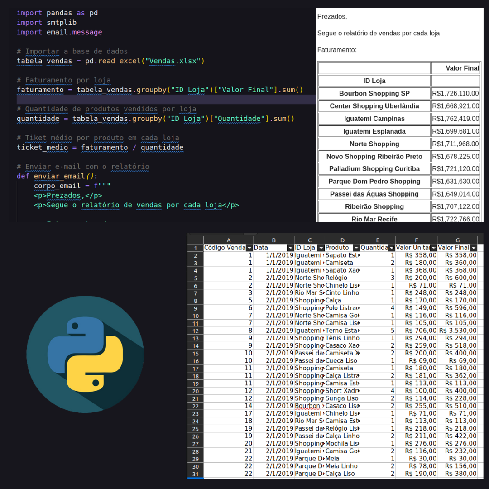

<h1 align="center"></h1>

Projeto Python para automatizar tarefas. 

  <a href="#-tecnologias">Tecnologias</a>&nbsp;&nbsp;&nbsp;|&nbsp;&nbsp;&nbsp;
  <a href="#-projeto">Projeto</a>&nbsp;&nbsp;&nbsp;|&nbsp;&nbsp;&nbsp;
  <a href="#-layout">Layout</a>&nbsp;&nbsp;&nbsp;|&nbsp;&nbsp;&nbsp;
  <a href="#memo-licença">Licença</a>

  

 

  

## 🚀 Tecnologias

Projeto criado para gerar um relatório mais "enxuto e mais resumido" de uma planilha com dados em exel."

- Python

## 💻 Projeto

-[Visite o projeto online]()

## 🔖 Layout

Você pode visualizar o layout do projeto através [DESSE LINK](. É necessário ter conta no [Figmam) para acessá-lo.

## :memo: Licença

Esse projeto está sob a licença MIT.

---
